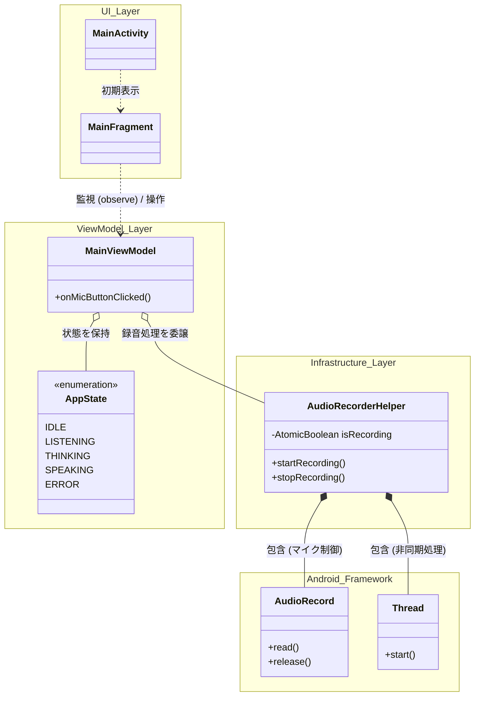
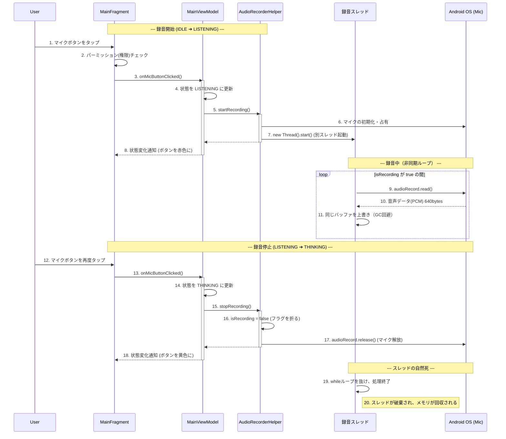

# android-study

Cloud RunのGateway LLMと通信し、MCPと連動するAndroid音声/チャットUI（Thin Client）の構築を目指す学習用プロジェクトです。

## 設計ドキュメント

- MVVMの基礎とステートマシンについて
  - ページ遷移とバリデーションを題材にした、MVVMの基本構造の図解です。（詳細は `docs/01_mvvm_basic.md` に退避・保存済み）

---

## 1. クラス図：音声UIのアーキテクチャと関心の分離

### 【クラス図の解説】
- **UI Layer**: 画面の描画と、Android OS特有の「マイク権限（パーミッション）の要求」のみを担当します。録音の実処理は持ちません。
- **ViewModel Layer**: アプリの状態（`IDLE`, `LISTENING`など）を管理し、UIからのボタンタップに応じて状態を遷移させます。
- **Infrastructure Layer**: 外部リソース（今回はハードウェアのマイク）にアクセスする専門のクラスです。将来的にRepositoryパターンを導入し、ViewModelから直接触れないように隠蔽する予定です。

---

## 2. シーケンス図：録音スレッドのライフサイクルとメモリ管理

マイクボタンを押してから、裏スレッドで録音が行われ、停止時に安全にリソースが解放されるまでの流れです。

### 【シーケンス図の解説】
- **非同期処理 (7〜11)**: 録音という重い処理をUIスレッドとは別の裏スレッド（`recordingThread`）で行うことで、画面のフリーズ（ANR）を防いでいます。
- **バッファの使い回し (11)**: 音声データを受け取る配列（バッファ）をループ内で毎回 `new` するのではなく、同じ配列を上書きし続けることで、GC（ガベージコレクション）によるプチフリーズ（音飛び）を回避しています。
- **安全な終了と解放 (16〜20)**: `stopRecording()` でループフラグを折ることでスレッドを自然終了させます。同時に `release()` を呼ぶことで、他アプリがマイクを使えなくなる不具合を確実に防いでいます。