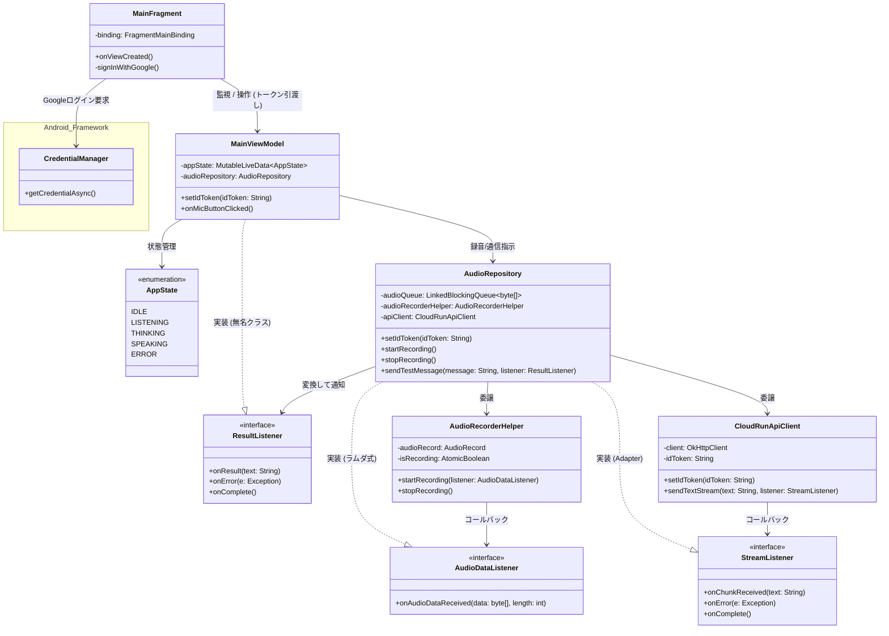
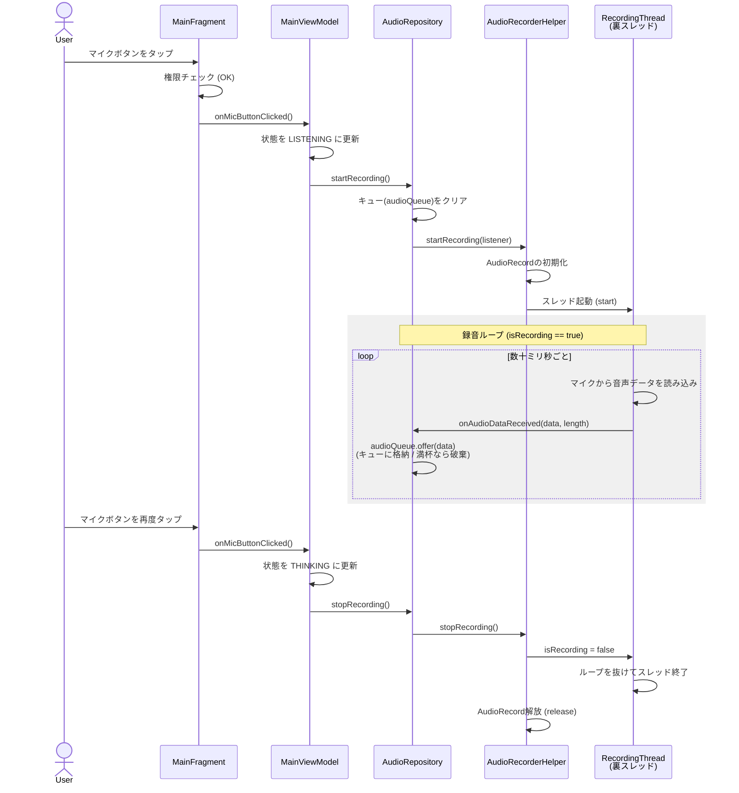
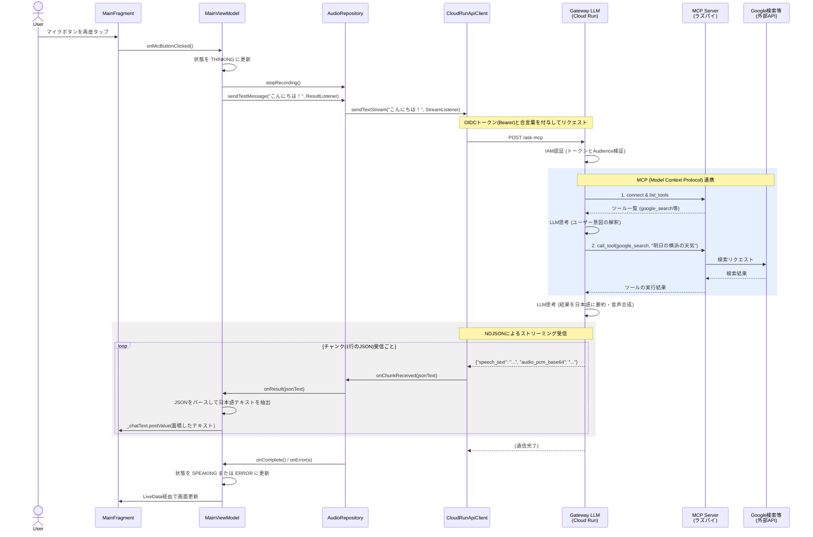
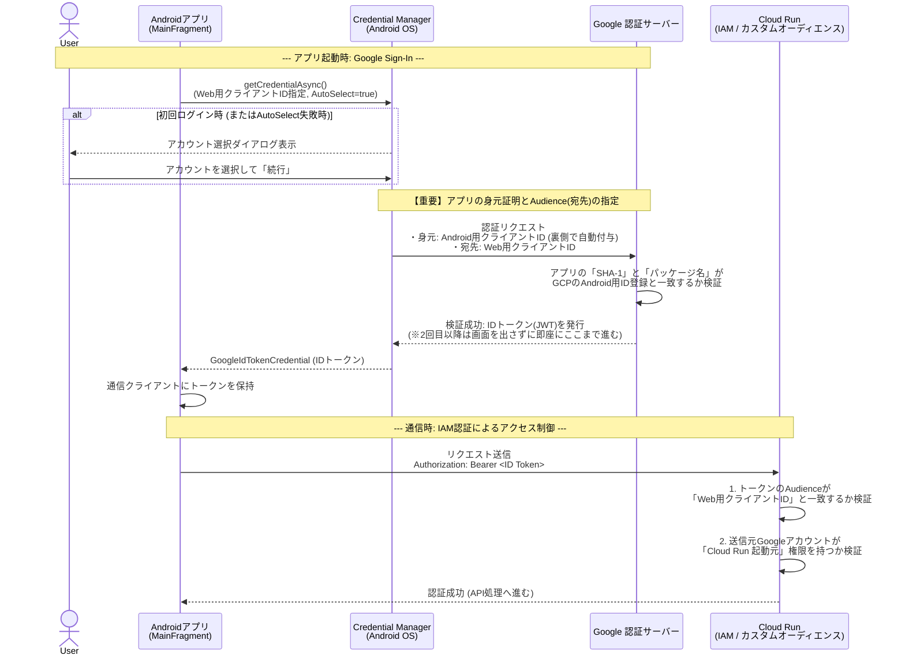

# android-study

Cloud RunのGateway LLMと通信し、MCPと連動するAndroid音声/チャットUI（Thin Client）の構築を目指す学習用プロジェクトです。

## 設計ドキュメント

- MVVMの基礎とステートマシンについて
  - ページ遷移とバリデーションを題材にした、MVVMの基本構造の図解です。（詳細は `docs/01_mvvm_basic.md` に退避・保存済み）

---

## 1. クラス図：音声・通信UIのアーキテクチャと関心の分離

### 【クラス図の解説】
- 関心の分離: Fragment(View) / ViewModel(UIの状態) / Repository(データ) / Infrastructure(ハードウェア制御) の各層が、自身の責務にのみ集中するよう綺麗に分離されています。 
- 一方通行の依存関係: 矢印は常に左から右へ流れており、UI層がデータ層の詳細を知らない（ViewModelはAudioRepositoryしか知らない）疎結合な設計が実現できています。 
- 依存関係逆転の原則: AudioRecorderHelperはAudioRepositoryを知りません。AudioDataListenerというインターフェース（契約）を介してコールバックすることで、RepositoryがHelperに依存するのではなく、両者が抽象（インターフェース）に依存する形となり、部品の独立性が高まっています。
- **Adapterパターンによる境界防衛**: `MainViewModel` (App層) が `StreamListener` (Infrastructure層) を直接知ることを防ぐため、Repository層に `ResultListener` を新設しました。`AudioRepository` がこれを中継（Adapterとして機能）することで、層をまたぐ直接的な依存を遮断しています。
- **Androidフレームワークとの連携**: `MainFragment` はUIの描画だけでなく、OSの機能である `CredentialManager` と連携して安全にIDトークンを取得し、それをViewModelへ横流しする責務も担っています。

---

## 2. シーケンス図：録音スレッドのライフサイクルとメモリ管理

マイクボタンを押してから、裏スレッドで録音が行われ、停止時に安全にリソースが解放されるまでの流れです。

### 【シーケンス図の解説】
- **UIスレッドの保護**: `startRecording()`の呼び出しはUIスレッドで行われますが、重い録音処理は即座に裏スレッド(`RecordingThread`)に委譲されるため、画面がフリーズすることはありません。
- **コールバックとキューイング**: 裏スレッドはマイクから読み取った音声データを`onAudioDataReceived`コールバックで`Repository`に通知します。`Repository`は受け取ったデータを`LinkedBlockingQueue`に格納（キューイング）します。
- **バックプレッシャー（背圧）への対応**: `audioQueue.offer()`は、キューが満杯の時に処理をブロックせず、データを破棄して`false`を返します。これにより、将来実装する通信処理（消費者）が遅延しても、録音スレッドが詰まって音飛びしたり、アプリがクラッシュしたりするのを防ぐ安全装置として機能します。

---

## 3. シーケンス図：クラウド通信とMCP連動ストリーミング受信

マイク録音停止後、テキストデータをCloud Runに送信し、LLMが自律的にMCP（ラズパイ）経由で外部ツールを使用し、その結果をパースして画面にリアルタイム表示するまでの流れです。

### 【シーケンス図の解説】 
- MCPによる自律的な機能拡張: Androidアプリからは単に「こんにちは！」というテキストを投げただけですが、Gateway LLMが自律的に「天気を調べる必要がある」と判断し、ラズパイのMCPサーバーへツールの実行を依頼しています。Android側は外部APIの存在を一切意識せず、要約された結果だけを受け取ることができます。 
- JSONのパースとUIの蓄積: Gateway LLMからは文字列だけでなく音声の生データ（Base64）を含んだ巨大なJSONが送られてきます。ViewModelは JSONObject を用いて必要な speech_text だけを抽出し、StringBuilder で過去のテキストに継ぎ足しながら画面を更新します。 

---

## 4. シーケンス図：Google Sign-In と Cloud Run IAM認証 (OAuth 2.0 / OIDC)

アプリ起動時に OAuth 2.0 / OIDC (OpenID Connect) ベースの Google 認証を行い、取得したIDトークンを用いてセキュアに Cloud Run (IAM) へアクセスするまでの一連の流れです。

### 【シーケンス図の解説】 
- 2つのOAuthクライアントIDの使い分け（最重要）: AndroidアプリからCloud Runへアクセスするには、GCP上で「Android用」と「Web用」の2つのクライアントIDを発行する必要があります。
  - **Android用クライアントID**: アプリの正当性を証明する名札。Googleの認証サーバーは、通信元のアプリの `SHA-1` と `パッケージ名` がこのIDの設定と一致しているかを検証し、偽装アプリからのアクセスを弾きます。
  - **Web用クライアントID**: トークンの宛先（Audience）。Androidアプリは「私の身元はAndroid用IDで証明しますが、トークンはあのWebサーバー（Web用ID）宛てに発行してください」と要求します。 
- **OIDCとIAMによる強固なバックエンド**: Cloud RunのIAMは、受け取ったトークンが「正しい宛先（Web用ID）に向けて発行されたか」と「リクエスト元のGmailアドレスが許可されているか」を厳格にチェックします。これにより、URLやアプリのソースコードが流出しても第三者は絶対にアクセスできないセキュアな基盤が実現されています。
- **AutoSelectEnabledによるUX向上**: `CredentialManager` の設定により、一度ログインしてOSとの信頼関係が確立されると、2回目以降は「続行」ボタンを押す手間すら省かれ、バックグラウンドで透過的（自動的）にこれらの認証・トークン発行処理が行われます。