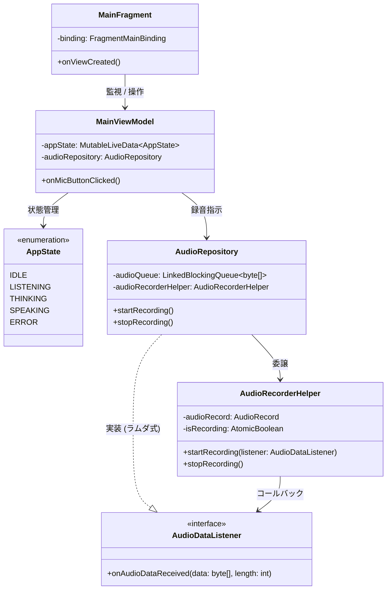
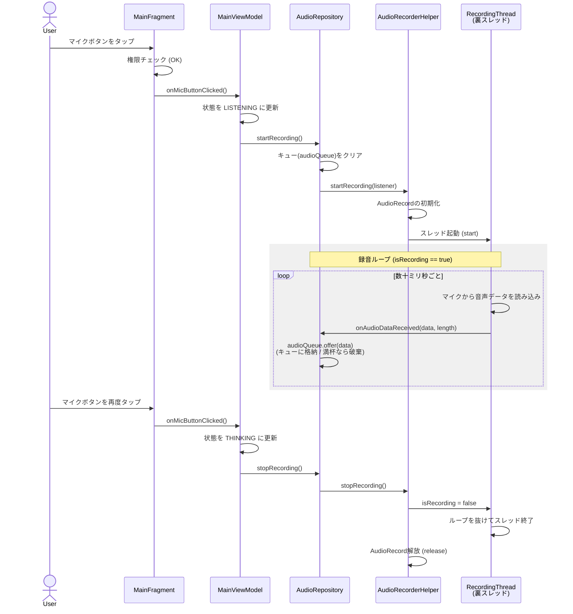

# android-study

Cloud RunのGateway LLMと通信し、MCPと連動するAndroid音声/チャットUI（Thin Client）の構築を目指す学習用プロジェクトです。

## 設計ドキュメント

- MVVMの基礎とステートマシンについて
  - ページ遷移とバリデーションを題材にした、MVVMの基本構造の図解です。（詳細は `docs/01_mvvm_basic.md` に退避・保存済み）

---

## 1. クラス図：音声UIのアーキテクチャと関心の分離

### 【クラス図の解説】
- 関心の分離: Fragment(View) / ViewModel(UIの状態) / Repository(データ) / Infrastructure(ハードウェア制御) の各層が、自身の責務にのみ集中するよう綺麗に分離されています。 
- 一方通行の依存関係: 矢印は常に左から右へ流れており、UI層がデータ層の詳細を知らない（ViewModelはAudioRepositoryしか知らない）疎結合な設計が実現できています。 
- 依存関係逆転の原則: AudioRecorderHelperはAudioRepositoryを知りません。AudioDataListenerというインターフェース（契約）を介してコールバックすることで、RepositoryがHelperに依存するのではなく、両者が抽象（インターフェース）に依存する形となり、部品の独立性が高まっています。

---

## 2. シーケンス図：録音スレッドのライフサイクルとメモリ管理

マイクボタンを押してから、裏スレッドで録音が行われ、停止時に安全にリソースが解放されるまでの流れです。

### 【シーケンス図の解説】
- **UIスレッドの保護**: `startRecording()`の呼び出しはUIスレッドで行われますが、重い録音処理は即座に裏スレッド(`RecordingThread`)に委譲されるため、画面がフリーズすることはありません。
- **コールバックとキューイング**: 裏スレッドはマイクから読み取った音声データを`onAudioDataReceived`コールバックで`Repository`に通知します。`Repository`は受け取ったデータを`LinkedBlockingQueue`に格納（キューイング）します。
- **バックプレッシャー（背圧）への対応**: `audioQueue.offer()`は、キューが満杯の時に処理をブロックせず、データを破棄して`false`を返します。これにより、将来実装する通信処理（消費者）が遅延しても、録音スレッドが詰まって音飛びしたり、アプリがクラッシュしたりするのを防ぐ安全装置として機能します。