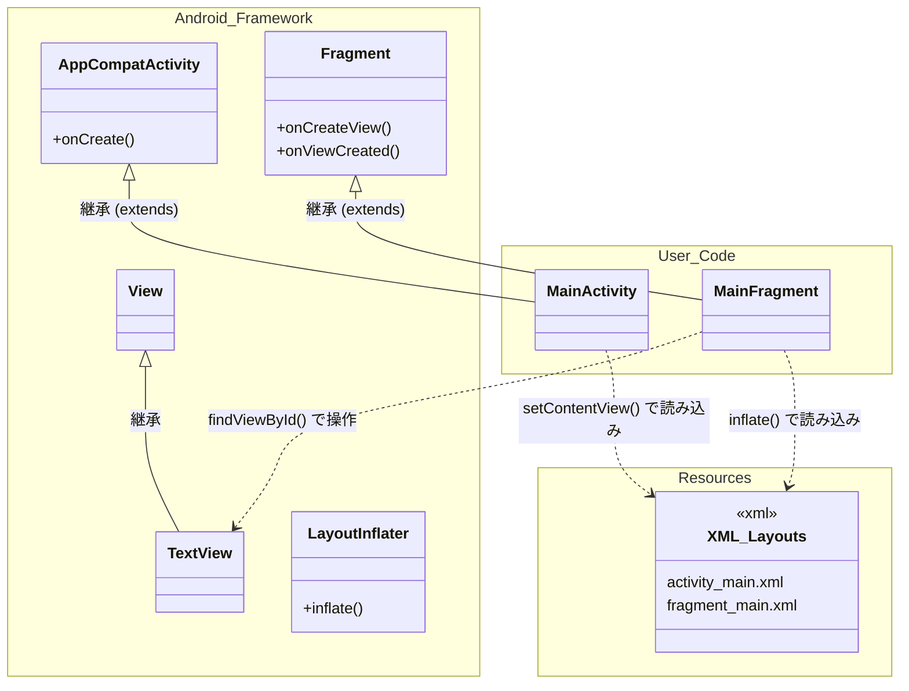
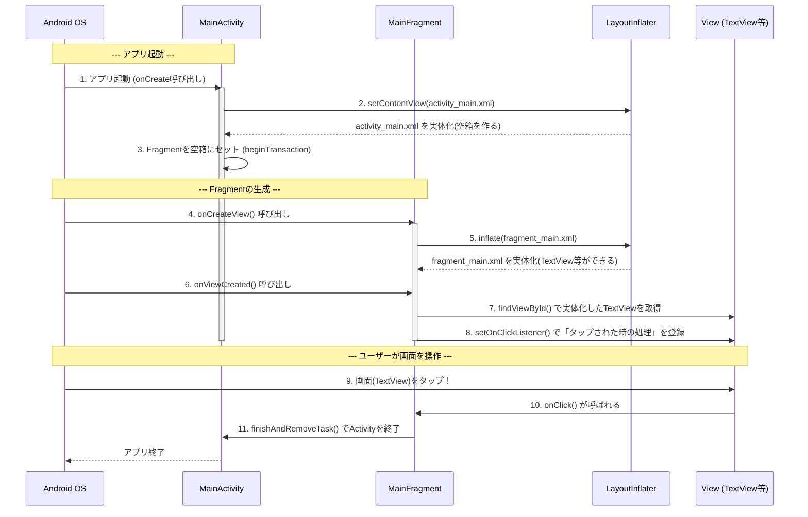

# android-study

## クラス図：フレームワークとユーザーコードの関係
Android開発の基本は、「**Android OSが用意してくれているベース（親クラス）を引き継いで（継承して）、自分オリジナルの機能を追加する**」という形をとります。

以下の図は、Android側（提供フレームワーク）とユーザー側の境界線を示したもの。

### 【図の解説】

- **継承（`<|--`）**： `MainActivity`は`AppCompatActivity`を、`MainFragment`は`Fragment`を継承しています。これにより、画面を表示したり、OSからのイベント（タップなど）を受け取ったりする複雑な仕組みをゼロから書かずに済みます。
- **XML（設計図）**： XMLはあくまで「こんな見た目にしてね」という**テキストベースの設計図**です。
- **LayoutInflater**： これはAndroidが提供する「大工さん」のようなクラスです。XML（設計図）を読み込んで、実際のJava上のオブジェクト（`View`や`TextView`など）をメモリ上に組み立ててくれます。これを「**インフレート（Inflate = 膨らませる、実体化する）**」と呼びます。

---

## シーケンス図：画面が作られてからタップされるまで

アプリが起動してから画面（XML）が読み込まれ、ユーザーがタップしてアプリが終了するまでの「時間の流れ（ライフサイクル）」。

### 【図の解説とXMLの役割】

- **主導権はAndroid OSにある（1, 4, 6, 9）**: 通常のJavaプログラムは `public static void main(String[] args)` から順番に動きますが、Androidでは「**OSが必要なタイミングで、ユーザが作成したクラスのメソッド（`onCreate`など）を呼び出す**」という動きをします。
- **XMLからViewへの変換（2, 5）**: `MainActivity` の `onCreate` や、`MainFragment` の `onCreateView` の中で XML ファイルを指定しています。ここで初めて、ただのテキストだったXMLが、画面に表示できるメモリ上のオブジェクト（View）に生まれ変わります。
- **Viewの操作（7, 8）**: `onViewCreated` は、「XMLからViewへの変換が完了した直後」に呼ばれるメソッドです。画面の部品はすでに完成しているので、ここで `findViewById` を使って特定の部品（今回は `text_view`）をプログラム側に引っ張ってきて、タップイベントなどを仕込みます。
