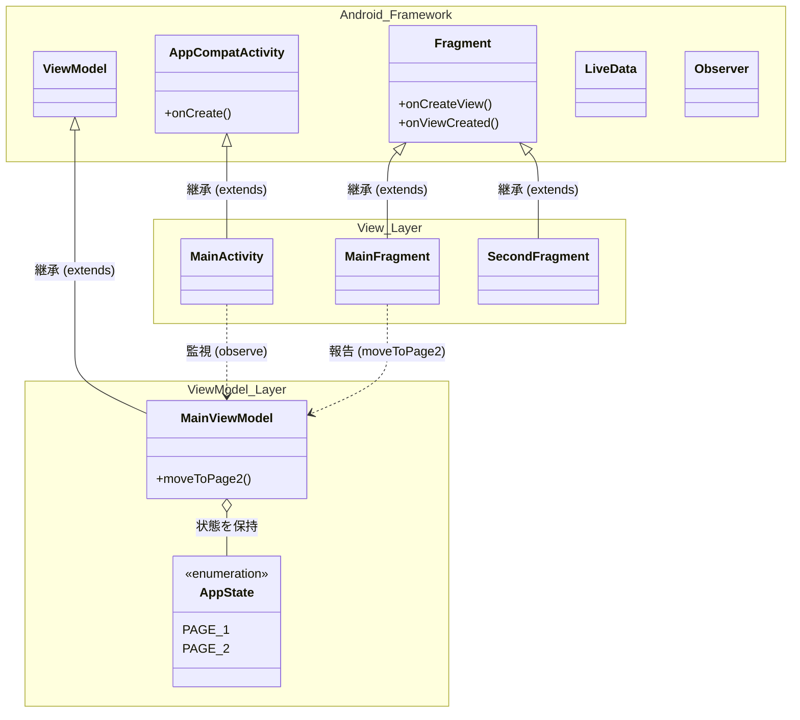
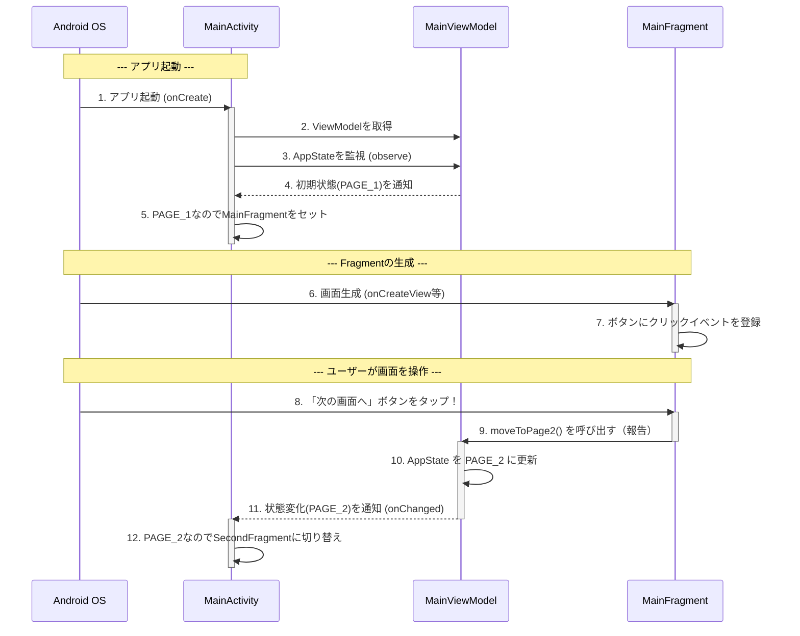

# android-study

## クラス図：フレームワークとユーザーコードの関係
Android開発の基本は、「**Android OSが用意してくれているベース（親クラス）を引き継いで（継承して）、自分オリジナルの機能を追加する**」という形をとります。
今回はそこに**MVVMアーキテクチャ**が加わり、役割分担が明確になりました。

### 【クラス図の解説】

- **View Layer（Activity/Fragment）**: 画面の表示とユーザー操作の受け付けのみを担当します。「次の画面が何か」という判断は行いません。
- **ViewModel Layer**: アプリの「状態（AppState）」を保持し、Viewからの報告を受けて状態を更新します。
- **単方向データフロー**: Fragment ➔ (報告) ➔ ViewModel ➔ (状態変更・通知) ➔ Activity という、矢印が一方通行で回る設計になっています。
- **継承（`<|--`）**: `MainActivity`は`AppCompatActivity`を、`MainFragment`などは`Fragment`を、`MainViewModel`は`ViewModel`を継承し、Androidフレームワークの強力な機能を利用しています。

---

## シーケンス図：MVVMとステートマシンによる画面遷移

アプリが起動し、ユーザーがボタンを押して画面が切り替わるまでの「時間の流れ」です。

### 【シーケンス図の解説：MVVMの魔法】

- **主導権はAndroid OSにある（1, 6, 8）**: Androidでは「OSが必要なタイミングで、ユーザが作成したクラスのメソッド（`onCreate`やタップイベントなど）を呼び出す」という動きをします。
- **Fragmentの責務軽減 (8, 9)**: 以前はFragment自身が `SecondFragment` を呼び出していましたが、MVVMでは単に「ボタンが押されました」とViewModelに報告するだけになりました。
- **LiveDataによるリアクティブな動き (10, 11, 12)**: ViewModelの内部状態が変わると、LiveDataを通じて自動的にActivityへ通知が飛びます。Activityは「状態がPAGE_2になったから、2ページ目を出す」というリアクティブ（反応的）な動きをしています。
- **関心の分離**: これにより、「画面の見た目とタップ検知（Fragment）」「今の状態と次にどうなるかのルール（ViewModel）」「状態に合わせた画面の切り替え（Activity）」という3つの役割が綺麗に分離されました。