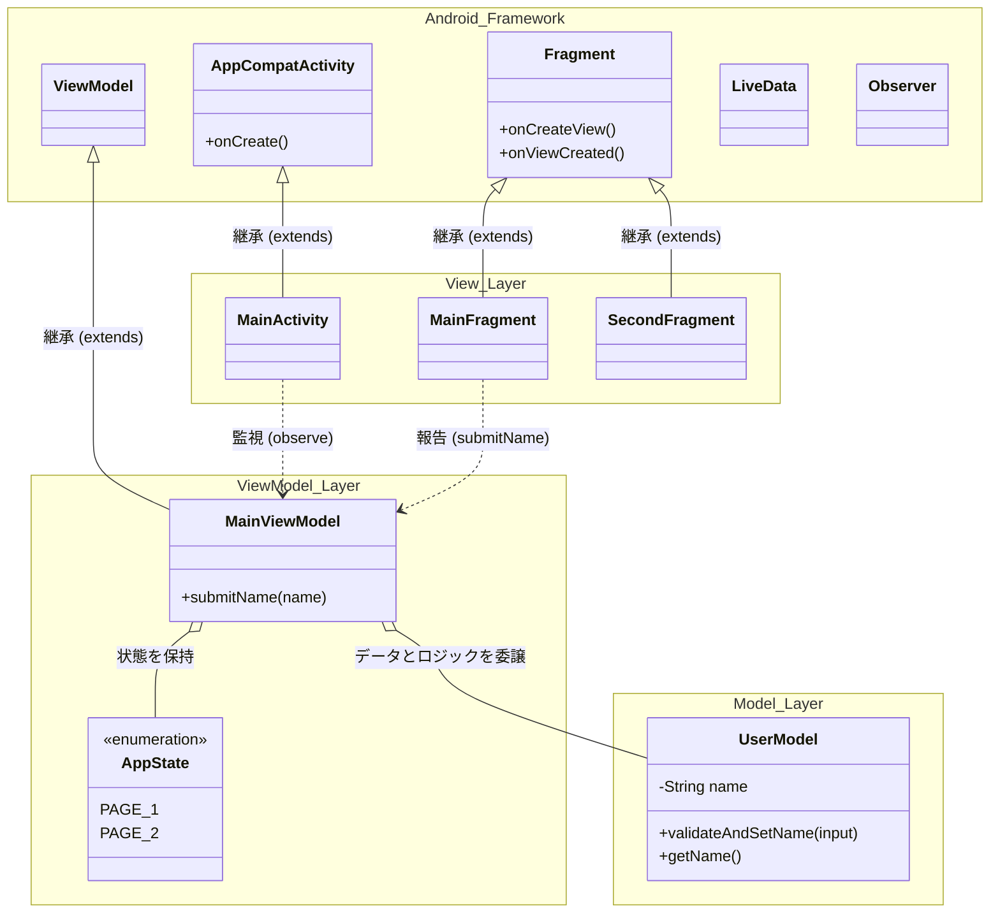
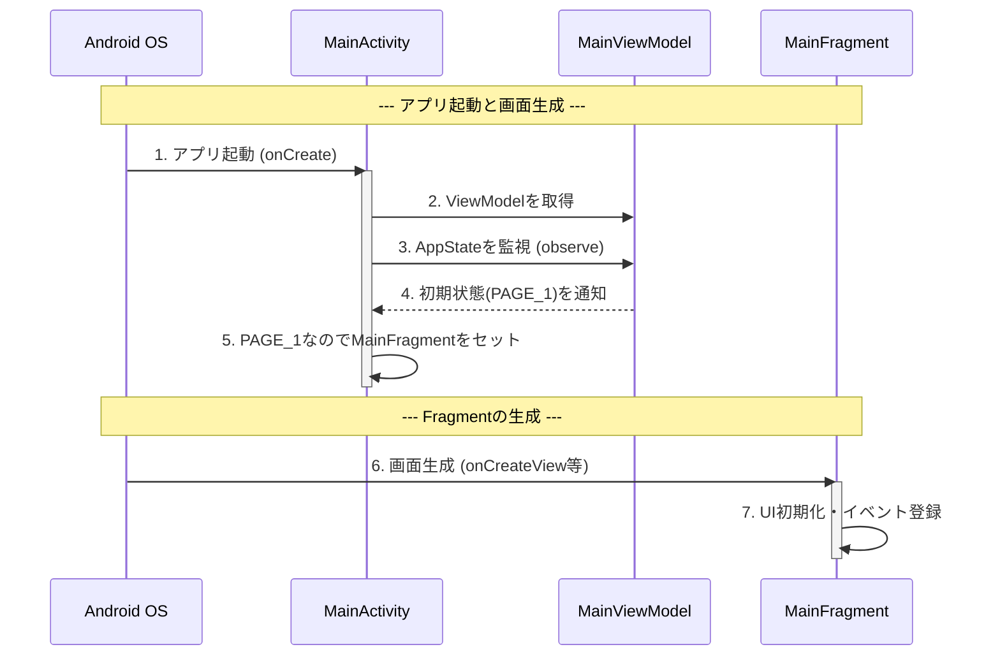
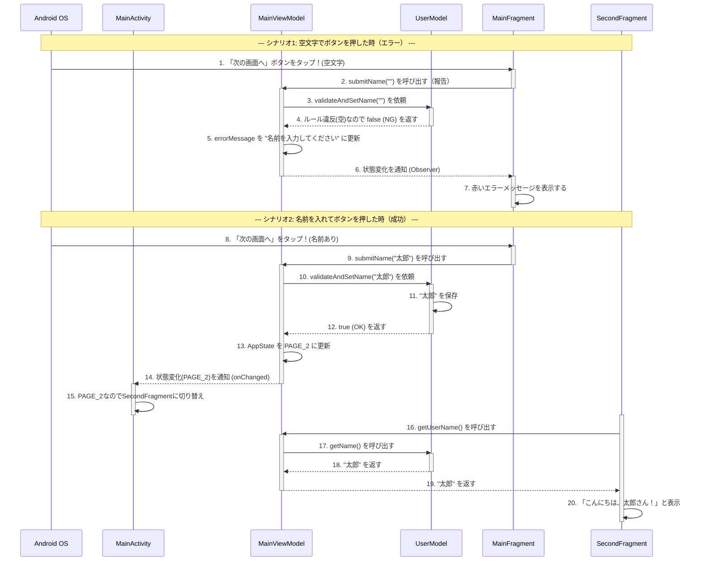

# android-study

## クラス図：フレームワークとユーザーコードの関係
Android開発の基本は、「**Android OSが用意してくれているベース（親クラス）を引き継いで（継承して）、自分オリジナルの機能を追加する**」という形をとります。
今回はそこに**MVVMアーキテクチャ**が加わり、役割分担が明確になりました。

### 【クラス図の解説】

- **Model Layer（UserModel）**: アプリのデータ保持と、ビジネスロジック（「空文字はNG」といった絶対的なルール）を担当します。画面（UI）のことは一切知りません。
- **ViewModel Layer**: アプリの「状態（AppStateやエラー表示）」を保持し、Viewからの報告を受け取ってModelに判断を仰ぎます。現場監督のような仲介役です。
- **View Layer（Activity/Fragment）**: 画面の描画と、ユーザー操作の受け付けのみを担当する「バカなコンポーネント」です。自分で文字数を数えたりはせず、ただViewModelに報告します。
- **単方向データフロー**: View ➔ (報告) ➔ ViewModel ➔ (依頼) ➔ Model ➔ (結果) ➔ ViewModel ➔ (状態変更・通知) ➔ View という、一方通行の流れが実現されています。
- **継承（`<|--`）**: `MainActivity`は`AppCompatActivity`を、`MainFragment`などは`Fragment`を、`MainViewModel`は`ViewModel`を継承し、Androidフレームワークの強力な機能を利用しています。

---

## シーケンス図1：アプリ起動と画面生成（初期化）

アプリが起動し、ViewModelが準備されて最初の画面（PAGE_1）が表示されるまでの流れです。
**※ここではまだユーザー操作が発生していないため、Model（UserModel）は出番がなく待機しています。**

### 【シーケンス図1の解説：アプリ起動の主導権】

- **主導権はAndroid OSにある（1, 6）**: Androidでは「OSが必要なタイミングで、ユーザが作成したクラスのメソッド（`onCreate`等）を呼び出す」という動きをします。アプリ起動時はOS主導で画面の準備が行われます。
- **ViewModelの準備（2〜4）**:  Activityが生成されると同時に`ViewModel`が取得され、初期状態（PAGE_1）が通知されます。この段階ではまだユーザー操作がないため、ビジネスロジック（`UserModel`）は登場しません。

---

## シーケンス図2：バリデーションと画面遷移のデータフロー

ユーザーがテキストを入力し、エラーが起きる場合と、成功して次の画面へ進む場合の「時間の流れ」です。
**※ここからいよいよ UserModel がビジネスロジックの判定者として活躍します。**

### 【シーケンス図2の解説：MVVMとビジネスロジックの分離】

- **Modelは必要な時だけ呼ばれる**: アプリ起動時などのUIの準備段階（図1）ではModelは一切登場しません。ユーザーがアクションを起こし「データやルールの判定」が必要になった時に初めてViewModelから呼び出されます。
- **View（Fragment）からIf文が消える (1〜2, 8〜9)**: Fragment自身は入力された文字が正しいかどうかを判断しません。ただ「この文字で進みたいです」とViewModelに丸投げします。
- **Modelがルールを判断する (3〜4, 10〜12)**: 「空文字はダメ」というルールを知っているのはModelだけです。これにより、UIの変更に影響されずにビジネスロジックだけをテストすることが可能になります。
- **リアクティブ（反応的）なUI更新 (5〜7, 13〜15)**: ViewModelが保持する「状態」が変わると、それを監視しているViewへ自動的に通知が飛びます。Viewは「状態が変わったから描画を変える」という受動的な動きをします。
- **次の画面へのデータ受け渡し (16〜20)**: 切り替わった `SecondFragment` は、表示される際に `ViewModel` へデータを要求します。`ViewModel` は自身ではデータを持たず、`Model`から取得したデータをそのまま `View` へ横流し（仲介）します。